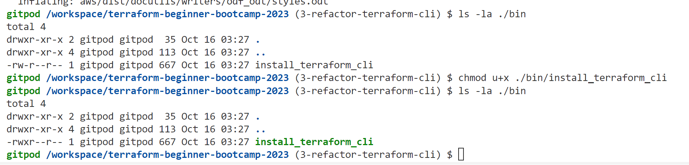

# Terraform Beginner Bootcamp 2023

## Semantic Versioning

More info available at:
[semver.org](https://semver.org/)

Given a version number **MAJOR.MINOR.PATCH**, increment the:

- **MAJOR** version when you make incompatible API changes
- **MINOR** version when you add functionality in a backward compatible manner
- **PATCH** version when you make backward compatible bug fixes

- Additional labels for pre-release and build metadata are available as extensions to the MAJOR.MINOR.PATCH format. eg `1.0.01`
- we do not need to do v1.0.01, even though many prefer to

We can also commit things to an issue, which is super cool!

## Shebangs.....what?

## Linux permissions/CHMOD

To see hidden files: ls -la
ls -la ./bin
Now let's change some permissions with chmod

Notice that we added the x to our permissions, that means that we turned this into an executable!
We did chmod u+x <- we added an executable to the user group

What does that accomplish for us? Instead of having to run 
source ./bin/install_terraform_cli 
Now we can just run
./bin/install_terraform_cli 
And it will run our file to get the appropriate setup running for us.

That's how to make bash/power shell scripts! 

Get good at it....

Want to make everything executable? 
chmod 777 ./bin/install_terraform_cli
And then fix it so it's not all executable?
chmod 744 ./bin/install_terraform_cli

In the gitpod.yml file, we do need to add source ./bin/install_terraform_cli bc it requires the source word
Also, in that file, instead of using init, we are going to use before: with our tasks