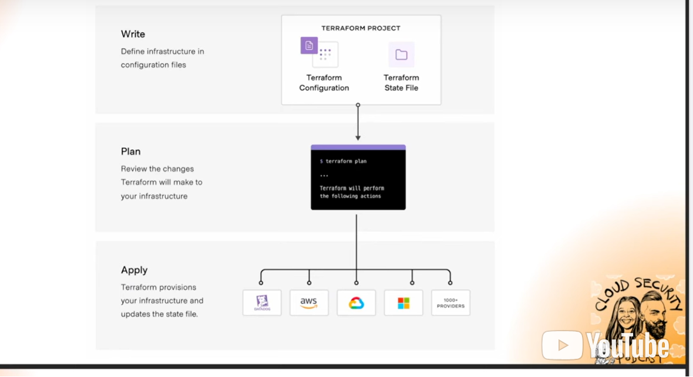

## How does TF work?

A TF workspace has the state file, which tells the TF engine what we need and where
Stored in TF Cloud or locally
Build a plan with `tf plan`
Then once we like the plan,`tf apply`

## Benefits of IAC Languages like AWS Cloud Formation

AWS uses CloudFormation like a template, but only with AWS
TF allows us to work with multiple cloud providers
Apply changes to Kubernetes, GCP, Azure
TF builds resources where you need them

## TF Cloud Setup Security Best Practices

TF/TF Cloud is IAC
IAC means any resource that you need to provision to run your business.
Shared risks with TF:

- unauthorized access
- data breaches
- injection attacks
- malware
- misconfigured access control
- insider threats
  You make a change in repo, it auto applies. Source code can have malware put into it.
  The state file is **SUPER IMPORTANT**. Manage access to TF Cloud so that not many have access to your state file.
  Limit people with access to projects/workspaces/modules.

When you log in to your account with TF Cloud, for orgs, use SSO.
Create new org, then create a workspace. It's a logical boundary to define the IAC source code.
A workspace is one concept, it could be projects and workspaces. Version control workflow workspace is convenient to use with GH.com.
Here comes a security practice to pay attention to! When giving GH auth to our account, don't give it access to all repos. **Only selected repos!** That follows the least privlege principals.
Now back in TF Cloud, finish setting up your workspace.
Set up a project that's well described in our workspaces.
Modules let us use private modules/repos to share. This is how we say "this is how I build my EC2 instances with AWS". Save it and reuse!
Can also search for public ones. You can use TF created ones. **Don't use modules made by randos that you don't know!!!!!!**
In the registry, you can look for modules/providers.

## TF Cloud Settings

Go to settings and set team members, add users to teams. The owner is like the super.

## Business Use Cases

- Apply sec best practices
- **Don't use modules made by randos that you don't know!!!!!!**
- This includes giving least TF Cloud access to GH repos
- In TF Cloud choose integration and choose organization to help with sec!
- Ask, are we building an app for an org? One project, one env. Multiple projects, multiple envs. Anything in an env can be shared between workspaces.
  
